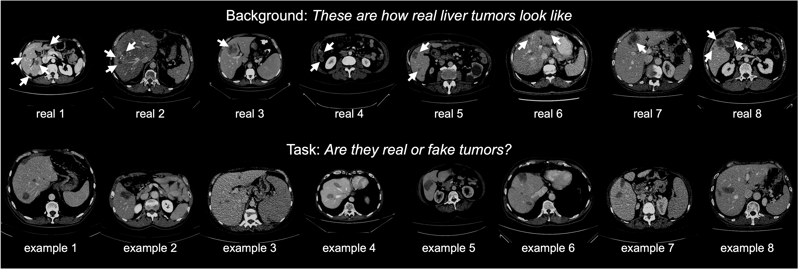

# Synthetic Tumors Make AI Segment Tumors Better

This repository provides extensive examples of synthetic liver tumors generated by our novel strategies. Check to see if you could tell which is real tumor and which is synthetic tumor. More importantly, our synthetic tumors can be used for training AI models, and have proven to achieve a similar (actually, *better*) performance in real tumor segmentation than a model trained on real tumors. 

**Amazing**, right? 

<p align="center"></p>
<p align="center"></p>

## Paper

<b>Label-Free Liver Tumor Segmentation</b> <br/>
[Qixin Hu](https://scholar.google.com/citations?user=EqD5GP8AAAAJ&hl=en)<sup>1</sup>, [Yixiong Chen](https://scholar.google.com/citations?hl=en&user=bVHYVXQAAAAJ)<sup>2</sup>, [Junfei Xiao](https://lambert-x.github.io/)<sup>3</sup>, Shuwen Sun<sup>4</sup>, [Jieneng Chen](https://scholar.google.com/citations?hl=en&user=yLYj88sAAAAJ)<sup>3</sup>, [Alan L. Yuille](https://www.cs.jhu.edu/~ayuille/)<sup>3</sup>, and [Zongwei Zhou](https://www.zongweiz.com/)<sup>3,*</sup> <br/>
<sup>1 </sup>Huazhong University of Science and Technology,  <br/>
<sup>2 </sup>The Chinese University of Hong Kong -- Shenzhen,  <br/>
<sup>3 </sup>Johns Hopkins University,   <br/>
<sup>4 </sup>The First Affiliated Hospital of Nanjing Medical University <br/>
CVPR, 2023 <br/>
[paper](https://arxiv.org/pdf/2303.14869.pdf) | [code](https://github.com/MrGiovanni/SyntheticTumors) | [talk](https://www.youtube.com/watch?v=Alqr3vQSDro) (by Alan Yuille)

<b>Synthetic Tumors Make AI Segment Tumors Better</b> <br/>
[Qixin Hu](https://scholar.google.com/citations?user=EqD5GP8AAAAJ&hl=en)<sup>1</sup>, [Junfei Xiao](https://lambert-x.github.io/)<sup>2</sup>, [Yixiong Chen](https://scholar.google.com/citations?hl=en&user=bVHYVXQAAAAJ)<sup>3</sup>, Shuwen Sun<sup>4</sup>, [Jieneng Chen](https://scholar.google.com/citations?hl=en&user=yLYj88sAAAAJ)<sup>2</sup>, [Alan L. Yuille](https://www.cs.jhu.edu/~ayuille/)<sup>2</sup>, and [Zongwei Zhou](https://www.zongweiz.com/)<sup>2,*</sup> <br/>
<sup>1 </sup>Huazhong University of Science and Technology,   <br/>
<sup>2 </sup>Johns Hopkins University, <br/>
<sup>3 </sup>The Chinese University of Hong Kong -- Shenzhen,   <br/>
<sup>4 </sup>The First Affiliated Hospital of Nanjing Medical University <br/>
Medical Imaging Meets NeurIPS, 2022 <br/>
[paper](https://arxiv.org/pdf/2210.14845.pdf) | [code](https://github.com/MrGiovanni/SyntheticTumors) | [slides](https://github.com/MrGiovanni/SyntheticTumors/blob/main/documents/slides.pdf) | [poster](https://github.com/MrGiovanni/SyntheticTumors/blob/main/documents/poster.pdf) | demo | [talk](https://www.youtube.com/watch?v=bJpI9tCTsuA)

We provide a list of publications related to tumor synthesis in [Awesome Synthetic Tumors](AWESOME.md) [](https://awesome.re).
   
## 0. Installation

```bash
git clone https://github.com/MrGiovanni/SyntheticTumors.git
cd SyntheticTumors
wget https://github.com/Project-MONAI/MONAI-extra-test-data/releases/download/0.8.1/model_swinvit.pt
```

See [installation instructions](https://github.com/MrGiovanni/SyntheticTumors/blob/main/INSTALL.md).

## 1. Train segmentation models using synthetic tumors

```
datapath=/mnt/zzhou82/PublicAbdominalData/

# UNET (no.pretrain)
CUDA_VISIBLE_DEVICES=0 python -W ignore main.py --optim_lr=4e-4 --batch_size=2 --lrschedule=warmup_cosine --optim_name=adamw --model_name=unet --val_every=200 --max_epochs=4000 --save_checkpoint --workers=2 --noamp --distributed --dist-url=tcp://127.0.0.1:12235 --cache_num=200 --val_overlap=0.5 --syn --logdir="runs/synt.no_pretrain.unet" --train_dir $datapath --val_dir $datapath --json_dir datafolds/healthy.json
# Swin-UNETR-Base (pretrain)
CUDA_VISIBLE_DEVICES=0 python -W ignore main.py --optim_lr=4e-4 --batch_size=2 --lrschedule=warmup_cosine --optim_name=adamw --model_name=swin_unetrv2 --swin_type=base --val_every=200 --max_epochs=4000 --save_checkpoint --workers=2 --noamp --distributed --dist-url=tcp://127.0.0.1:12231 --cache_num=200 --val_overlap=0.5 --syn --logdir="runs/synt.pretrain.swin_unetrv2_base" --train_dir $datapath --val_dir $datapath --json_dir datafolds/healthy.json --use_pretrained
# Swin-UNETR-Base (no.pretrain)
CUDA_VISIBLE_DEVICES=0 python -W ignore main.py --optim_lr=4e-4 --batch_size=2 --lrschedule=warmup_cosine --optim_name=adamw --model_name=swin_unetrv2 --swin_type=base --val_every=200 --max_epochs=4000 --save_checkpoint --workers=2 --noamp --distributed --dist-url=tcp://127.0.0.1:12231 --cache_num=200 --val_overlap=0.5 --syn --logdir="runs/synt.no_pretrain.swin_unetrv2_base" --train_dir $datapath --val_dir $datapath --json_dir datafolds/healthy.json
# Swin-UNETR-Small (no.pretrain)
CUDA_VISIBLE_DEVICES=0 python -W ignore main.py --optim_lr=4e-4 --batch_size=2 --lrschedule=warmup_cosine --optim_name=adamw --model_name=swin_unetrv2 --swin_type=small --val_every=200 --max_epochs=4000 --save_checkpoint --workers=2 --noamp --distributed --dist-url=tcp://127.0.0.1:12233 --cache_num=200 --val_overlap=0.5 --syn --logdir="runs/synt.no_pretrain.swin_unetrv2_small" --train_dir $datapath --val_dir $datapath --json_dir datafolds/healthy.json
# Swin-UNETR-Tiny (no.pretrain)
CUDA_VISIBLE_DEVICES=0 python -W ignore main.py --optim_lr=4e-4 --batch_size=2 --lrschedule=warmup_cosine --optim_name=adamw --model_name=swin_unetrv2 --swin_type=tiny --val_every=200 --max_epochs=4000 --save_checkpoint --workers=2 --noamp --distributed --dist-url=tcp://127.0.0.1:12234 --cache_num=200 --val_overlap=0.5 --syn --logdir="runs/synt.no_pretrain.swin_unetrv2_tiny" --train_dir $datapath --val_dir $datapath --json_dir datafolds/healthy.json
```

## 2. Train segmentation models using real tumors (for comparison)

```
datapath=/mnt/zzhou82/PublicAbdominalData/

# UNET (no.pretrain)
CUDA_VISIBLE_DEVICES=0 python -W ignore -W ignore main.py --optim_lr=4e-4 --batch_size=2 --lrschedule=warmup_cosine --optim_name=adamw --model_name=unet --val_every=200 --val_overlap=0.5 --max_epochs=4000 --save_checkpoint --workers=2 --noamp --distributed --dist-url=tcp://127.0.0.1:12235 --cache_num=200 --logdir="runs/real.no_pretrain.unet" --train_dir $datapath --val_dir $datapath --json_dir datafolds/lits.json
# Swin-UNETR-Base (pretrain)
CUDA_VISIBLE_DEVICES=0 python -W ignore -W ignore main.py --optim_lr=4e-4 --batch_size=2 --lrschedule=warmup_cosine --optim_name=adamw --model_name=swin_unetrv2 --swin_type=base --val_every=200 --val_overlap=0.5 --max_epochs=4000 --save_checkpoint --workers=2 --noamp --distributed --dist-url=tcp://127.0.0.1:12231 --cache_num=200 --logdir="runs/real.pretrain.swin_unetrv2_base" --train_dir $datapath --val_dir $datapath --json_dir datafolds/lits.json --use_pretrained
# Swin-UNETR-Base (no.pretrain)
CUDA_VISIBLE_DEVICES=0 python -W ignore -W ignore main.py --optim_lr=4e-4 --batch_size=2 --lrschedule=warmup_cosine --optim_name=adamw --model_name=swin_unetrv2 --swin_type=base --val_every=200 --val_overlap=0.5 --max_epochs=4000 --save_checkpoint --workers=2 --noamp --distributed --dist-url=tcp://127.0.0.1:12232 --cache_num=200 --logdir="runs/real.no_pretrain.swin_unetrv2_base" --train_dir $datapath --val_dir $datapath --json_dir datafolds/lits.json
# Swin-UNETR-Small (no.pretrain)
CUDA_VISIBLE_DEVICES=0 python -W ignore -W ignore main.py --optim_lr=4e-4 --batch_size=2 --lrschedule=warmup_cosine --optim_name=adamw --model_name=swin_unetrv2 --swin_type=small --val_every=200 --val_overlap=0.5 --max_epochs=4000 --save_checkpoint --workers=2 --noamp --distributed --dist-url=tcp://127.0.0.1:12233 --cache_num=200 --logdir="runs/real.no_pretrain.swin_unetrv2_small" --train_dir $datapath --val_dir $datapath --json_dir datafolds/lits.json
# Swin-UNETR-Tiny (no.pretrain)
CUDA_VISIBLE_DEVICES=0 python -W ignore -W ignore main.py --optim_lr=4e-4 --batch_size=2 --lrschedule=warmup_cosine --optim_name=adamw --model_name=swin_unetrv2 --swin_type=tiny --val_every=200 --val_overlap=0.5 --max_epochs=4000 --save_checkpoint --workers=2 --noamp --distributed --dist-url=tcp://127.0.0.1:12234 --cache_num=200 --logdir="runs/real.no_pretrain.swin_unetrv2_tiny" --train_dir $datapath --val_dir $datapath --json_dir datafolds/lits.json
```

## 3. Evaluation

#### AI model trained by synthetic tumors

```
datapath=/mnt/zzhou82/PublicAbdominalData/

# UNET (no.pretrain)
CUDA_VISIBLE_DEVICES=0 python -W ignore validation.py --model=unet --val_overlap=0.75 --val_dir $datapath --json_dir datafolds/lits.json --log_dir runs/synt.no_pretrain.unet --save_dir out
# Swin-UNETR-Base (pretrain)
CUDA_VISIBLE_DEVICES=0 python -W ignore validation.py --model=swin_unetrv2 --swin_type=base --val_overlap=0.75 --val_dir $datapath --json_dir datafolds/lits.json --log_dir runs/synt.pretrain.swin_unetrv2_base --save_dir out
# Swin-UNETR-Base (no.pretrain)
CUDA_VISIBLE_DEVICES=0 python -W ignore validation.py --model=swin_unetrv2 --swin_type=base --val_overlap=0.75 --val_dir $datapath --json_dir datafolds/lits.json --log_dir runs/synt.no_pretrain.swin_unetrv2_base --save_dir out
# Swin-UNETR-Small (no.pretrain)
CUDA_VISIBLE_DEVICES=0 python -W ignore validation.py --model=swin_unetrv2 --swin_type=small --val_overlap=0.75 --val_dir $datapath --json_dir datafolds/lits.json --log_dir runs/synt.no_pretrain.swin_unetrv2_small --save_dir out
# Swin-UNETR-Tiny (no.pretrain)
CUDA_VISIBLE_DEVICES=0 python -W ignore validation.py --model=swin_unetrv2 --swin_type=tiny --val_overlap=0.75 --val_dir $datapath --json_dir datafolds/lits.json --log_dir runs/synt.no_pretrain.swin_unetrv2_tiny --save_dir out
```

#### AI model trained by real tumors

```
datapath=/mnt/zzhou82/PublicAbdominalData/

# UNET (no.pretrain)
CUDA_VISIBLE_DEVICES=0 python -W ignore validation.py --model=unet --val_overlap=0.75 --val_dir $datapath --json_dir datafolds/lits.json --log_dir runs/real.no_pretrain.unet --save_dir out
# Swin-UNETR-Base (pretrain)
CUDA_VISIBLE_DEVICES=0 python -W ignore validation.py --model=swin_unetrv2 --swin_type=base --val_overlap=0.75 --val_dir $datapath --json_dir datafolds/lits.json --log_dir runs/real.pretrain.swin_unetrv2_base --save_dir out
# Swin-UNETR-Base (no.pretrain)
CUDA_VISIBLE_DEVICES=0 python -W ignore validation.py --model=swin_unetrv2 --swin_type=base --val_overlap=0.75 --val_dir $datapath --json_dir datafolds/lits.json --log_dir runs/real.no_pretrain.swin_unetrv2_base --save_dir out
# Swin-UNETR-Small (no.pretrain)
CUDA_VISIBLE_DEVICES=0 python -W ignore validation.py --model=swin_unetrv2 --swin_type=small --val_overlap=0.75 --val_dir $datapath --json_dir datafolds/lits.json --log_dir runs/real.no_pretrain.swin_unetrv2_small --save_dir out
# Swin-UNETR-Tiny (no.pretrain)
CUDA_VISIBLE_DEVICES=0 python -W ignore validation.py --model=swin_unetrv2 --swin_type=tiny --val_overlap=0.75 --val_dir $datapath --json_dir datafolds/lits.json --log_dir runs/real.no_pretrain.swin_unetrv2_tiny --save_dir out
```


## TODO

- [x] Upload the paper to arxiv
- [ ] Make a video about Visual Turing Test (will appear in YouTube)
- [ ] Make an online app for Visual Turing Test
- [x] Apply for a US patent
- [ ] Upload the evaluation code for small tumors
- [ ] Upload the evaluation code for the false-positive study
- [ ] Make a Jupyter Notebook for tumor synthesis

## Citation

```
@article{hu2023label,
  title={Label-Free Liver Tumor Segmentation},
  author={Hu, Qixin and Chen, Yixiong and Xiao, Junfei and Sun, Shuwen and Chen, Jieneng and Yuille, Alan and Zhou, Zongwei},
  journal={arXiv preprint arXiv:2303.14869},
  year={2023}
}

@article{hu2022synthetic,
  title={Synthetic Tumors Make AI Segment Tumors Better},
  author={Hu, Qixin and Xiao, Junfei and Chen, Yixiong and Sun, Shuwen and Chen, Jie-Neng and Yuille, Alan and Zhou, Zongwei},
  journal={NeurIPS Workshop on Medical Imaging meets NeurIPS},
  year={2022}
}
```

## Acknowledgement

This work was supported by the Lustgarten Foundation for Pancreatic Cancer Research and the McGovern Foundation. The segmentation backbone is based on [Swin UNETR](https://github.com/Project-MONAI/tutorials/blob/main/3d_segmentation/swin_unetr_btcv_segmentation_3d.ipynb); we appreciate the effort of the [MONAI Team](https://monai.io/) to provide and maintain open-source code to the community. We thank Camille Torrico and Alexa Delaney for improving the writing of this paper. Paper content is covered by patents pending.
